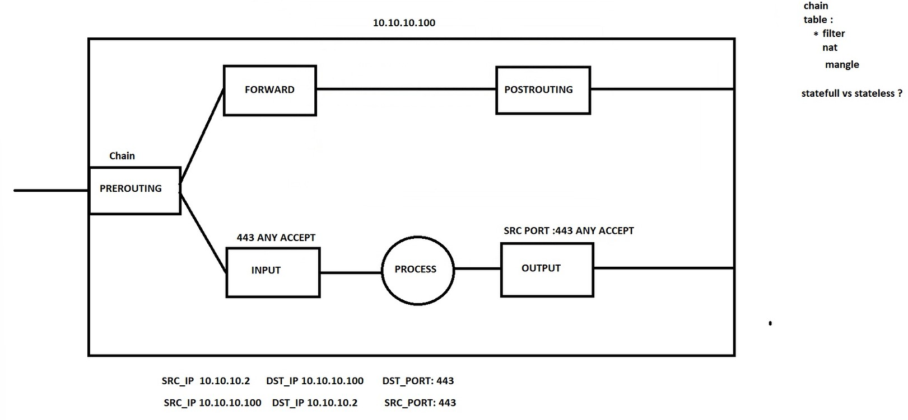

# Firewalls
How to configure firewalls in linux.

<ul>
<li>1.Iptables</li>
<li>2.Firewalld</li>
<li>3.NFTables</li>
</ul>

Firewalld is legacy now.

<h3>Table</h3>
<ul>
<li>1.filter</li>
<li>2.nat</li>
<li>3.mangle</li>
</ul>

every firewall in world is statefull or stateless.iptables is stateless and you should write input and output rules.

chains are like this

<ul>
<li>1.prerouting</li>
<li>2.forward</li>
<li>3.input</li>
<li>4.output</li>
<li>5.postrouting</li>
</ul>

# Iptable
here are some rules in iptables

<ul>
<li>by defualt shows all rules in filter chain.to see all rules in iptables:

    iptable -nL

</li>
<li>iptables sample scenario:

To drop all inbound traffic

    iptables -A INPUT -s 192.168.21.1 -j DROP

to track all old connection and drops new connection(its good FOR MAINTing servers),to look for who connected to our servers <code>netstat -tnlp</code>.

    iptables -A INPUT -s 192.168.21.1 -m conntrack --ctstate NEW,ESTABLISHED -j DROP

when you want insert rule to 3rd line in tables just:

    iptables -I INPUT 3 -s 192.168.21.1 -m conntrack --ctstate NEW -j DROP

when you want insert rules in first table just:

    iptables -I INPUT -s 192.168.21.1 -m conntrack --ctstate NEW -j DROP

for deleting that rule:

    iptables -D INPUT -s 192.168.21.1 -m conntrack --ctstate NEW -j DROP

192.168.21.1 ----> Server ---> Ping ---> ACCEPT

</li>

<li>2.a scenario that you can ssh to outside but nobody can ssh into your server

inbound traffic is accepted

    iptables -A INPUT -p tcp --dport 22 -s 192.168.21.1 -j ACCEPT

Drops whatever gets out

    iptables -A INPUT -j DROP

outbound traffic is accepted

    iptables -A OUTPUT -p tcp --sport 22 -d 192.168.21.1. -j ACCEPT

Drops whatever gets in

    iptables -A OUTPUT -j DROP

</li>
<li>3.a scenario that accepts ICMP traffic: 

    iptables -A INPUT -p icmp --icmp-type echo-request -j ACCEPT -m comment --comment "Accept ICMP Traffic"
    iptables -A OUTPUT -p icmp --icmp-type echo-reply -j ACCEPT -m comment --comment "Accept ICMP Traffic"

</li>

</ul>

<h3>ICMP-Types:</h3>

<ul>

<li>1.echo-request</li>

<li>2.echo-reply</li>

<li>3.mangle</li>

</ul>

