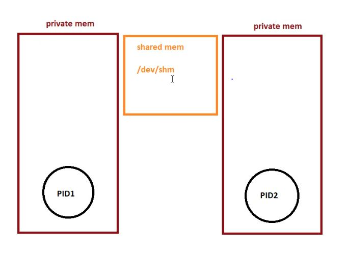

# Docker
Docker is a set of platform as a service (PaaS) products that use OS-level virtualization to deliver software in packages called container.

# Installation
if you want install it on Red-Hat Based linux just run <code>install.sh</code> .

# what is NameSpace? 
Namespaces are a feature of the Linux kernel that partitions kernel resources such that one set of processes sees one set of resources and another set of processes sees a different set of resources. The feature works by having the same namespace for a group of resources and processes, but those namespaces refer to distinct resources.<a href="https://en.wikipedia.org/wiki/Linux_namespaces">[Link]</a>.There are seven common types of namespaces in wide use today. Using the apartment as our guide, let's walk through a summary of what each type does. Below is a brief overview of each namespace type. In subsequent articles, we will show how each namespace works by example.<a href="https://www.redhat.com/sysadmin/7-linux-namespaces">[Link]</a>

<ul>
<li>1.mnt(Mount)

has an independent list of mount points seen by the processes in the namespace. This means that you can mount and unmount filesystems in a mount namespace without affecting the host filesystem.

</li>
<li>2.net(Network interfaces)

has an independent network stack: its own private routing table, set of IP addresses, socket listing, connection tracking table, firewall, and other network‑related resources.

</li>
<li>3.pid(Process isolation)

assigns a set of PIDs to processes that are independent from the set of PIDs in other namespaces. The first process created in a new namespace has PID 1 and child processes are assigned subsequent PIDs. If a child process is created with its own PID namespace, it has PID 1 in that namespace as well as its PID in the parent process’ namespace. See below for an example.

</li>
<li>4.ipc(Interprocess communication)

has its own IPC resources, for example POSIX message queues.

</li>
<li>
5. user namespace:

has its own set of user IDs and group IDs for assignment to processes. In particular, this means that a process can have root privilege within its user namespace without having it in other user namespaces.

</li>
<li>6.UNIX Time‑Sharing (UTS) namespace

allows a single system to appear to have different host and domain names to different processes.

</li>
</ul>
<a href="https://www.nginx.com/blog/what-are-namespaces-cgroups-how-do-they-work/">Resource[Link]</a>

# what is Cgroup?

<a href="https://www.nginx.com/blog/what-are-namespaces-cgroups-how-do-they-work/">Resource[Link] </a>.A control group (cgroup) is a Linux kernel feature that limits, accounts for, and isolates the resource usage (CPU, memory, disk I/O, network, and so on) of a collection of processes.Cgroups provide the following features:
<ul>
<li>Resource limits:

You can configure a cgroup to limit how much of a particular resource (memory or CPU, for example) a process can use.

</li>
<li>Prioritization:

You can control how much of a resource (CPU, disk, or network) a process can use compared to processes in another cgroup when there is resource contention.

</li>
<li>Accounting:

Resource limits are monitored and reported at the cgroup level.

</li>
<li>Control:

You can change the status (frozen, stopped, or restarted) of all processes in a cgroup with a single command.

</li>
</ul>

Cgroups provide the following features:

Resource limits – You can configure a cgroup to limit how much of a particular resource (memory or CPU, for example) a process can use.
Prioritization – You can control how much of a resource (CPU, disk, or network) a process can use compared to processes in another cgroup when there is resource contention.
Accounting – Resource limits are monitored and reported at the cgroup level.
Control – You can change the status (frozen, stopped, or restarted) of all processes in a cgroup with a single command.

So basically you use cgroups to control how much of a given key resource (CPU, memory, network, and disk I/O) can be accessed or used by a process or set of processes. Cgroups are a key component of containers because there are often multiple processes running in a container that you need to control together. In a Kubernetes environment, cgroups can be used to implement resource requests and limits and corresponding QoS classes at the pod level.

# Conclusion (namespace and cgroups)

Namespaces and cgroups are the building blocks for containers and modern applications. Having an understanding of how they work is important as we refactor applications to more modern architectures.Namespaces provide isolation of system resources, and cgroups allow for fine‑grained control and enforcement of limits for those resources.Containers are not the only way that you can use namespaces and cgroups. Namespaces and cgroup interfaces are built into the Linux kernel, which means that other applications can use them to provide separation and resource constraints. 

# How to start first container ?

       docker container run alpine sleep 100000
              image 
              volume
              network

       docker container run -d --name webapp sleep 1000
       docker container run -d nginx 

List images:

       docker container ls -a
       docker container ls -aq

Stop one or more running containers:

       docker container stop busy_dijkstra

Kill one or more running containers:

       docker container kill flamboyant_ganguly

The only option for docker stop is -t (–time) which allows you to specify a wait time before stopping a container. 10 seconds is the default value, which is supposed to be enough for the container to gracefully stop:

       docker container stop --time 2

This command force-removes a running container:

       docker container rm --force jovial_haibt

Display detailed information on one or more containers:

       docker container inspect webapp

Show last 20 logs in Container:

       docker container logs -f --tail 20 pingapp

To delete all volumes:

       docker container rm --force $(docker container ls -qa)

Run a command in a running container

       docker container exec -it sleepapp sh
       docker container exec -it --user=amin sleepapp sh
       docker container exec -it --workdir=/opt sleepapp sh
       docker container exec -it --env class=devops sleepapp sh

       docker container inspect sleepapp  -f "{{.NetworkSettings.Networks.bridge.IPAddress}}"

detach the terminal from container output:

       CTRL+P+Q

       docker container cp sleepapp:/opt/script.sh .
       docker container cp script.sh sleepapp:/opt/

       docker container restart sleepapp

       docker container stats $(docker container ls -qa)

       docker container update sleepapp --restart always

       docker container run -d --name pingapp --restart always alpine ping 8.8.8.8

       unshare --fork  --pid --mount  --net /bin/sh

# docker restart policy

<a href="https://docs.docker.com/config/containers/start-containers-automatically/">link</a>
       

# Docker Image
<a href="https://jfrog.com/devops-tools/article/understanding-and-building-docker-images/">Resource</a>
A Docker image is a read-only template containing a set of instructions for creating a container that can run on the Docker platform. It provides a convenient way to package up applications and preconfigured server environments, which you can use for your own private use or share publicly with other Docker users. Docker images are also the starting point for anyone using Docker for the first time.you can also see this <a href="https://docs.docker.com/storage/storagedriver/">link</a> for more information.

       

# Image creation way : 

	1. Dockerfile
	2. Download from dockerhub
	3. commit from running container

# Dockerfile
Docker file that will contain the necessary instructions to create the environment.

       # A dockerfile must always start by importing the base image.
       # We use the keyword 'FROM' to do that.
       # In our example, we want import the python image.
       # So we write 'python' for the image name and 'latest' for the version.
       FROM python:latest

       # In order to launch our python code, we must import it into our image.
       # We use the keyword 'COPY' to do that.
       # The first parameter 'main.py' is the name of the file on the host.
       # The second parameter '/' is the path where to put the file on the image.
       # Here we put the file at the image root folder.
       COPY main.py /

       # We need to define the command to launch when we are going to run the image.
       # We use the keyword 'CMD' to do that.
       # The following command will execute "python ./main.py".
       CMD [ "python", "./main.py" ]
`

       FROM python:2.7
       RUN mkdir /app
       WORKDIR /app
       COPY app.py .
       CMD ["python","app.py"]

       FROM alpine:latest
       RUN apk update
       RUN mkdir /app
       CMD ping 8.8.8.8

<a href="https://www.freecodecamp.orgnewsa-beginners-guide-to-docker-how-to-create-your-first-docker-application-cc03de9b639f/">Resource</a>

Docker Container
Docker Image
      Dockerfile
--------------

       192.168.63.47:/sources/python.tar
       username: root
       password: Aa111111

       scp 192.168.63.47:/sources/python.tar /root

       docker image save python:2.7 > python.tar
       docker image load < python.tar

       docker image pull python:2.7

       sample python app (app.py)
--------------------
       import time
       time.sleep(60)
       print("Docker Class")
       time.sleep(100)

Sample Dockerfile
------------------------
       FROM python:2.7
       RUN mkdir /app && .... \
       WORKDIR /app
       COPY app.py .
       CMD ["python","app.py"]

       docker image build . -t myapp:v1.1

       CMD ["nginx", "-g", "daemon off;"]

       CMD
       ENTRYPOINT
-------------------
       FROM alpine:latest
       RUN apk update && apk add iputils
       ENTRYPOINT ping 8.8.8.8

       docker container commit pingapp mynginx:v1.2

