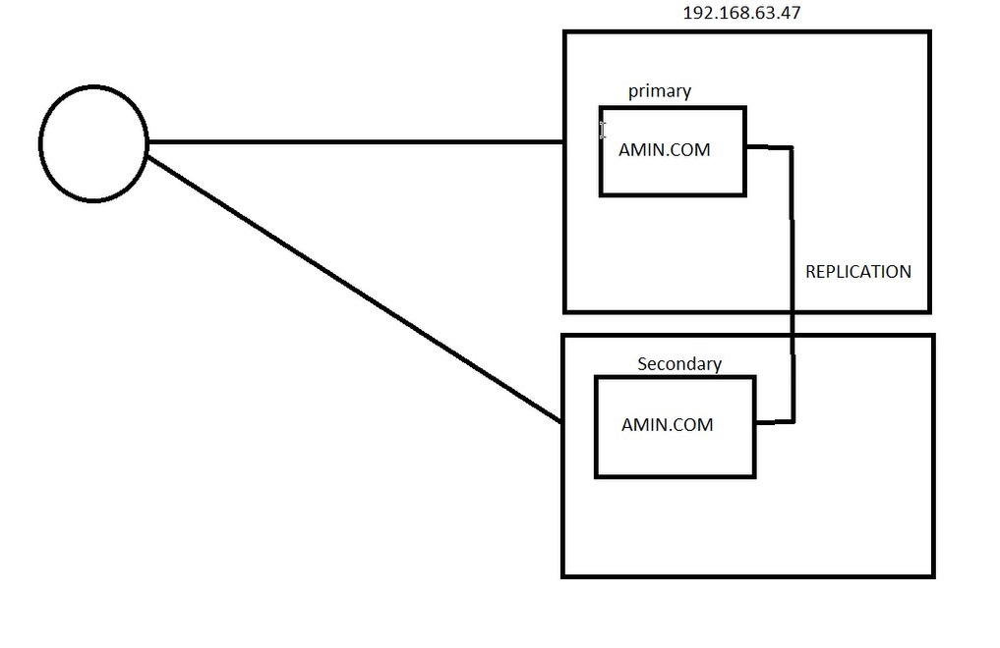

# How Configure DNS as secondary name server
as we previously saw in Bind Master Zone we configure <code>/etc/named.conf</code> and added this settings:

    zone "amin.com" {
            type master;
            file "/var/named/data/amin.db";
            allow-update { none; };

    };

we should edit <code>/etc/named.conf</code> again to configure DNS to be as secondary name servers:

    zone "amin.com" {
            type slave;
            file "/var/named/data/amin.db";
            masters { 192.168.63.47; };
            allow-transfer { 192.168.63.48; };
    };

and also in ... server we should add this to configuration file:
  

    zone "amin.com" {
            type master;
            file "/var/named/data/amin.db";
            allow-update { none; };
            allow-transfer { 192.168.63.48; };

    };

and then we should our DNS settings: 

    rndc reload
    rndc reload amin.com
    named-checkzone amin.com /var/named/data/amin.db

