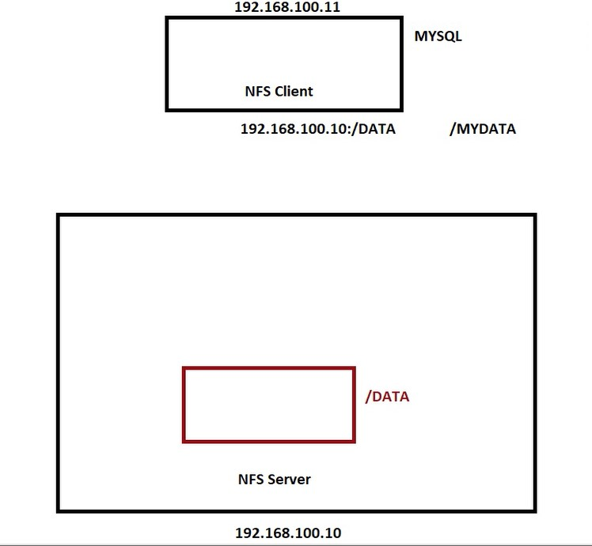

# NFS (Network File System)
nfs is usefull for transfering files in network.on both servers(client and also server) we should install nfs-utils.keep in mind that nfs is a filesystem just like other file systems. 

<ul>
<li>1.On NFS Server we should install these packages:

    yum -y install nfs-utils
    systemctl start nfs-server

we should start 

    systemctl start rpcbind

if you are working with redhat linux you should use this command for starting rpcbind

 
    systemctl start nfs-lock

to check if our packages installed or not just type these command:

    systemctl list-units | grep nfs

and then make a directory in directory we want to share:

    mkdir /NFS-Share

putt bellow line in <code>"/etc/exports"</code>

    
    /NFS-Share	192.168.63.47(rw,sync,no_root_squash,no_all_squash)

</li>

<li>On NFS Client we should install these packages:

    yum -y install nfs-utils
    systemctl start nfs-server

and then make a directory:

    mkdir /DATA

Mount them to where ever we wanted to:

    mount -t nfs 192.168.63.47:/NFS-Share  /DATA

</li>

</ul>

